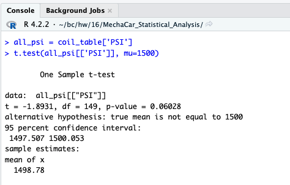
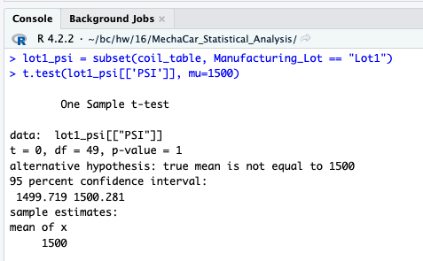
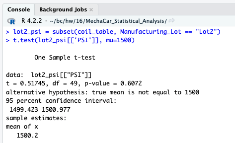
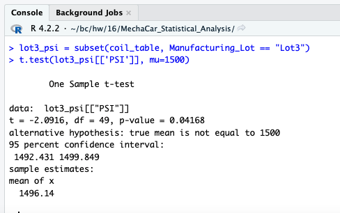

# Auto Statistical Analysis

## Overview:
Applying my understanding of statistics and hypothesis testing to analyze a series of datasets from the automotive industry. This analysis includes visualizations, statistical tests, and interpretation of the results. All statistical analysis and visualizations are written in the R programming language.

---
### Resources:
* Source Code: [Challenge Script](MechaCarChallenge.R)
* Source Data: [MechaCar MPG](MechaCar_mpg.csv), [Suspension Coil](Suspension_Coil.csv)
* Technology: [R](https://www.r-project.org/), [Tidyverse](https://www.tidyverse.org/)

---
### Deliverables:
- [x] Deliverable 1: Linear Regression to Predict MPG
- [x] Deliverable 2: Summary Statistics on Suspension Coils
- [x] Deliverable 3: T-Test on Suspension Coils
- [x] Deliverable 4: Design a Study Comparing the MechaCar to the Competition 

---
### Linear Regression to Predict MPG:

To better predict fuel efficiency (mpg), the dependent variable, I applied the multiple linear regression model with other variables of interest. These variables included vehicle length, vehicle weight, spoiler angle, ground clearance and AWD. Two variables that provided a non-random amount of variance to the mpg values in the dataset are:

   - Vehicle length, p-value: 2.60e-12
   - Ground Clearance, p-value: 5.21e-08

Both have statistically significant p-values, less than the alpha .05 established prior to performing the linear regression. 

The slope of the linear model is not considered to be zero, there is statistically significant correlation between fuel efficiency (mpg) and the independent variables. 

The multiple r-squared is .71 with a p-value of 5.35e-11, both are statistically significant and should be considered. However the intercept of 5.08e-08 is statistically significant, which can mean there are other variables and factors that contribute to the variation in fuel efficieny (mpg) that may not be included in the linear regression model. In order to improve the model to better predict the fuel efficiency (mpg) of MechaCar prototypes effectively we should continue to examine the effects of other variables not currently in our dataset. 

---
### Summary Statistics on Suspension Coils:

When summarizing the manufacturing lots in total the suspension coil data has a variance of 62.29 pounds per square inch. This is below 100 pounds per square inch that the design specifications dictate. 

Breaking down the data further and grouping by manufacturing lot we see Lot 3 has exceeded the design specfications and has a variance of 170.29 pounds per square inch. Lot 3 is skewing the data, this should be considered when making a decision. 

---
### T-Tests on Suspension Coils:

The t-test results show Lot 3's mean PSI of 1496.14 is statistically significant with a p-value of .04. We reject the null hypothesis, the PSI is not equal to 1500. This is in alignment with our previous findings of high variance in Lot 3's PSI. 

---
### Study Design: MechaCar vs Competition:
As a consumer, when purchasing a car the two most important factors are safety and price. For this study I will compare MechaCAr's safety rating and price vs the competition's. The safety rating for cars can be found on the [NHTSA](https://www.nhtsa.gov/ratings) site.

The null hypothesis states the safety rating does not effect the price of a car. 

The alternative hypothesis states that safety rating does increase the price of the car. 

I will test this hypothesis with the chi-squared test, creating categorical ranges for price (low-end, mid-range, high-end) and comparing that to the categorical safety ratings (A,B,C,D,F).  

I will need the dataset of available MechaCars, that data will include car make, model, year and price. I will add a column for safety rating and assign the letter based on the NHTSA report. Additionally I will make the pricing range column and assign based on ranges. The competition dataset will include the same information. 

If the p-value is less than .05 I will reject the null hypothesis, the safety rating does effect the price of the car.  
